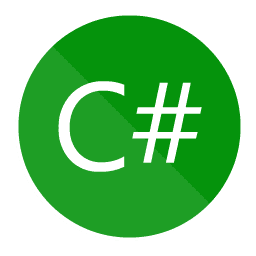

<h1 align="center">
  
</h1>

<h5 align="center">
  <code>
    <a href="https://www.linkedin.com/in/wallace-oliveira/" title="LinkedIn Profile"> LinkedIn</a></code>
  <code><a href="mailto: wallacetavaresoliveira84@gmail.com" title="Gmail "> Gmail</a></code>
  <code><a href="https://www.instagram.com/wallace_toliveira/" title="Instagram Profile"> Instagram</a></code>
</h5>
 
Olá, sou Wallace Oliveira, Full Stack Developer. 
   🔬Atualmente estudo para melhorar minhas habilidades de front-end e back-end. 
   📠Meu primeiro contato com a programação foi em 2017. Focando primeiramente em cursos de plataformas especializadas em ensino a distância, a fim de obter primeiras experiências com programação. 
   📠Fiz alguns cursos livres, boot camps até entrar em um dos programas da Recode em 2021.
   💻Eu amo escrever código e aprender qualquer coisa sobre isso 
   💬 Pergunte alguma coisa sobre <a href="https://www.instagram.com/wallace_toliveira/" title="Issues">Aqui</a> e veja meu portifólio 
  
  

  <a href="https://github.com/Wallace-Tavares-Oliveira">
  
  

  
   </a>
<h2 align="center">🔥 Linguagens - Frameworks 🔥</h2> 
  

  <code></code>
    <code></code>
  <code></code>
  <code></code>
  <code></code>
  <code></code>
  <code></code> <b>-</b> 
  <code></code>
  <code></code>
  <code></code>

   </a>
<h2 align="center">🔥 Ferramentas & Habilidades 🔥</h2> 

  <code></code>
  <code></code>
    <code></code>
  <code></code>
  <code></code>
  <code></code>
    <code></code>
    <code></code>
  <code></code>
  <code></code>
    <code></code>
  <code></code>
  <code></code>
  <code></code>
  <code></code>

 
  
 

